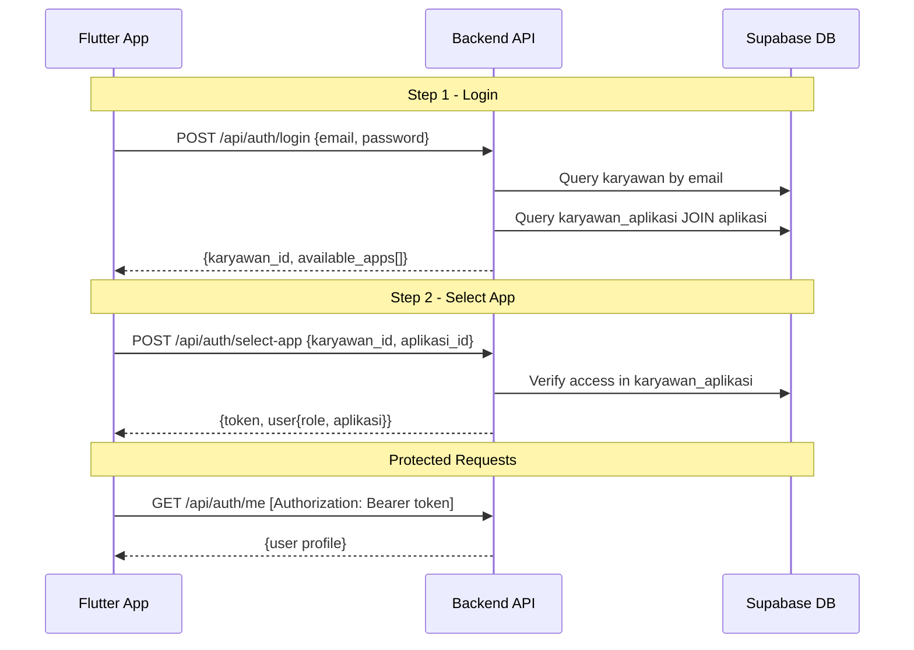

# Design Document: Two-Step Authentication Login

## Overview

Sistem login 2-step authentication untuk aplikasi Maintenance Tracking (MT). Arsitektur ini memungkinkan satu karyawan memiliki akses ke multiple aplikasi dengan role berbeda di setiap aplikasi. Flow terdiri dari:

1. **Step 1 - Login**: Validasi email + password → Return list aplikasi yang bisa diakses
2. **Step 2 - Select App**: Pilih aplikasi → Generate JWT token spesifik untuk aplikasi tersebut

## Architecture



## Components and Interfaces

### Backend API (Node.js/Express)

#### 1. POST /api/auth/login

**Request:**
```json
{
  "email": "user@nkp.com",
  "password": "password123"
}
```

**Response (Success - 200):**
```json
{
  "success": true,
  "karyawan_id": "uuid-karyawan",
  "email": "user@nkp.com",
  "full_name": "John Doe",
  "available_apps": [
    {
      "karyawan_aplikasi_id": "uuid-1",
      "aplikasi_id": "uuid-app-mt",
      "nama_aplikasi": "Maintenance Tracking",
      "kode_aplikasi": "MT",
      "role": "Operator"
    }
  ]
}
```

**Error Responses:**
- 401: Email/password salah
- 403: Akun tidak aktif
- 400: Email/password tidak diisi

#### 2. POST /api/auth/select-app

**Request:**
```json
{
  "karyawan_id": "uuid-karyawan",
  "aplikasi_id": "uuid-app-mt"
}
```

**Response (Success - 200):**
```json
{
  "success": true,
  "token": "eyJhbGciOiJIUzI1NiIs...",
  "user": {
    "karyawan_id": "uuid-karyawan",
    "email": "user@nkp.com",
    "full_name": "John Doe",
    "role": "Operator",
    "aplikasi": {
      "nama": "Maintenance Tracking",
      "kode": "MT"
    }
  }
}
```

**Error Responses:**
- 403: Tidak memiliki akses ke aplikasi
- 400: karyawan_id/aplikasi_id tidak diisi

#### 3. GET /api/auth/me (Protected)

**Header:** `Authorization: Bearer <token>`

**Response (Success - 200):**
```json
{
  "success": true,
  "user": {
    "karyawan_id": "uuid",
    "email": "user@nkp.com",
    "full_name": "John Doe",
    "role": "Operator",
    "profile_picture": "url-or-null",
    "aplikasi": {
      "nama": "Maintenance Tracking",
      "kode": "MT"
    }
  }
}
```

**Error Responses:**
- 401: Token tidak valid/expired/missing

### Flutter Components

#### 1. ApiClient (lib/services/api_client.dart)
- HTTP client dengan token management
- Auto-attach Authorization header
- Handle 401 → trigger logout

#### 2. AuthService (lib/services/auth_service.dart)
- `login(email, password)` → LoginResponse
- `selectApp(karyawanId, aplikasiId)` → SelectAppResponse
- `getProfile()` → UserProfile
- `logout()` → void

#### 3. AuthProvider (lib/providers/auth_provider.dart)
- State management untuk auth flow
- Handle 2-step flow logic
- Auto-select jika hanya 1 MT app

#### 4. StorageService (lib/services/storage_service.dart)
- Save/load JWT token
- Save/load user data
- Clear all on logout

## Data Models

### Backend JWT Payload
```javascript
{
  karyawan_id: "uuid",
  karyawan_aplikasi_id: "uuid",
  email: "user@nkp.com",
  role: "Operator",
  aplikasi_kode: "MT",
  iat: 1234567890,
  exp: 1235172690  // 7 days
}
```

### Flutter Models

#### LoginResponse
```dart
class LoginResponse {
  final String karyawanId;
  final String email;
  final String fullName;
  final List<AvailableApp> availableApps;
}
```

#### AvailableApp
```dart
class AvailableApp {
  final String karyawanAplikasiId;
  final String aplikasiId;
  final String namaAplikasi;
  final String kodeAplikasi;
  final String role;
}
```

#### SelectAppResponse
```dart
class SelectAppResponse {
  final String token;
  final AppUser user;
}
```

#### AppUser
```dart
class AppUser {
  final String karyawanId;
  final String email;
  final String fullName;
  final String role;
  final String? profilePicture;
  final AppInfo aplikasi;
}

class AppInfo {
  final String nama;
  final String kode;
}
```

## Correctness Properties

*A property is a characteristic or behavior that should hold true across all valid executions of a system-essentially, a formal statement about what the system should do. Properties serve as the bridge between human-readable specifications and machine-verifiable correctness guarantees.*

### Property 1: Valid credentials return complete response
*For any* valid email/password combination where karyawan is_active is true, the login response SHALL contain karyawan_id, email, full_name, and available_apps array.
**Validates: Requirements 1.1, 1.2**

### Property 2: Select-app returns valid JWT with correct claims
*For any* valid karyawan_id and aplikasi_id combination where access exists in karyawan_aplikasi, the response SHALL contain a JWT token with karyawan_id, karyawan_aplikasi_id, email, role, and aplikasi_kode claims, plus user object with role and aplikasi info.
**Validates: Requirements 2.1, 2.2, 2.3**

### Property 3: JWT token expiry is 7 days
*For any* generated JWT token, decoding the token SHALL show an expiry time of 7 days from generation.
**Validates: Requirements 2.5**

### Property 4: Valid token returns complete profile
*For any* valid JWT token, the /api/auth/me endpoint SHALL return user profile containing karyawan_id, email, full_name, role, profile_picture, and aplikasi info.
**Validates: Requirements 3.1, 3.2**

### Property 5: Single MT app triggers auto-select
*For any* login response where available_apps contains exactly one app with kode_aplikasi "MT", the Flutter app SHALL automatically call select-app for that app.
**Validates: Requirements 4.2**

### Property 6: Token stored after select-app
*For any* successful select-app call, the JWT token SHALL be stored in SharedPreferences and attached to subsequent API requests.
**Validates: Requirements 4.4, 4.6**

### Property 7: Logout clears all stored data
*For any* logout action, all stored data (token, user info) SHALL be cleared from SharedPreferences.
**Validates: Requirements 5.1, 5.2**

### Property 8: 401 response triggers auto-logout
*For any* API response with status 401, the Flutter app SHALL clear stored data and redirect to login.
**Validates: Requirements 5.4**

### Property 9: Model serialization round-trip
*For any* valid LoginResponse, AvailableApp, SelectAppResponse, or AppUser object, serializing to JSON and deserializing back SHALL produce an equivalent object.
**Validates: Requirements 6.1, 6.2, 6.3, 6.4**

## Error Handling

### Backend Error Codes
| Status | Condition | Message |
|--------|-----------|---------|
| 400 | Missing required fields | "Email dan password harus diisi" |
| 401 | Invalid credentials | "Email atau password salah" |
| 401 | Invalid/expired token | "Token tidak valid" |
| 403 | Inactive account | "Akun tidak aktif" |
| 403 | No app access | "Tidak memiliki akses ke aplikasi" |
| 500 | Server error | "Terjadi kesalahan server" |

### Flutter Error Handling
- Network errors → Show connection error message
- 401 errors → Auto-logout, redirect to login
- 403 errors → Show access denied message
- 500 errors → Show generic error message

## Testing Strategy

### Unit Tests
- Test model serialization/deserialization
- Test StorageService save/load/clear operations
- Test AuthService method calls
- Test AuthProvider state transitions

### Property-Based Tests
Property-based testing will use the `dart_check` library (or `glados` for Dart).

Each property test will:
- Generate random valid inputs
- Execute the operation
- Verify the property holds
- Run minimum 100 iterations

Test annotations format:
```dart
// **Feature: two-step-auth-login, Property 9: Model serialization round-trip**
// **Validates: Requirements 6.1, 6.2, 6.3, 6.4**
```

### Integration Tests
- Test complete 2-step login flow
- Test auto-select behavior
- Test logout flow
- Test 401 auto-logout
