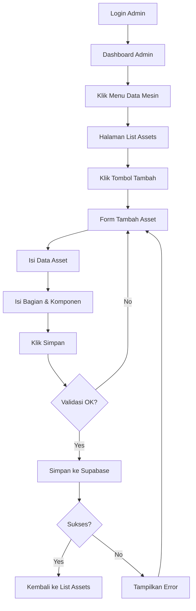

# 🎯 PANDUAN LENGKAP - Setup & Penggunaan Fitur Tambah Asset

## 📋 Overview

Implementasi ini menambahkan fitur **Tambah Asset** untuk Admin dengan integrasi **Supabase** sebagai database backend. Admin dapat menambahkan data asset/mesin beserta bagian-bagian dan komponen-komponennya secara lengkap melalui form yang user-friendly.

---

## ⚡ Quick Start (3 Langkah Mudah)

### 1️⃣ Setup Database di Supabase

**A. Buat/Login ke Supabase Project**
- Login ke [Supabase Dashboard](https://app.supabase.com)
- Gunakan project yang sudah ada: `dxzkxvczjdviuvmgwsft`

**B. Jalankan SQL Schema**
1. Di Supabase Dashboard, klik **SQL Editor** (sidebar kiri)
2. Klik **New Query**
3. Copy seluruh isi file `database_schema.sql` (ada di root project)
4. Paste ke SQL Editor
5. Klik **Run** (atau tekan `Ctrl+Enter`)
6. Tunggu sampai semua tabel berhasil dibuat

**C. Dapatkan Credentials**
1. Klik **Project Settings** (icon ⚙️) → **API**
2. Copy **Project URL**: `https://dxzkxvczjdviuvmgwsft.supabase.co`
3. Copy **anon public** key (key yang panjang)

### 2️⃣ Konfigurasi di Aplikasi

**A. Edit Config File**
1. Buka file: `lib/config/supabase_config.dart`
2. Ganti `YOUR_SUPABASE_ANON_KEY_HERE` dengan key yang di-copy tadi:

```dart
static const String supabaseAnonKey = 'eyJhbGciOiJIUzI1NiIsInR5cCI6IkpXVCJ9...'; // Paste disini
```

**B. Install Dependencies** (sudah dilakukan)
```powershell
flutter pub get
```

### 3️⃣ Jalankan Aplikasi

```powershell
flutter run
```

**Selesai!** 🎉 Aplikasi siap digunakan.

---

## 📱 Cara Menggunakan Fitur Tambah Asset

### Login → Data Mesin → Tambah → Isi Form → Simpan

Lihat panduan detail di file **`QUICK_START_ADMIN.md`** untuk tutorial lengkap dengan screenshot dan contoh pengisian.

---

## 📂 File & Folder Penting

### 📄 File Konfigurasi & Database
- `database_schema.sql` - SQL script untuk membuat tabel di Supabase
- `lib/config/supabase_config.dart` - **EDIT FILE INI** dengan Anon Key Anda
- `SUPABASE_SETUP.md` - Dokumentasi teknis Supabase
- `QUICK_START_ADMIN.md` - Panduan penggunaan untuk Admin

### 🔧 File Kode Utama
- `lib/main.dart` - Entry point, inisialisasi Supabase
- `lib/services/supabase_service.dart` - Singleton service untuk Supabase client
- `lib/repositories/asset_repository.dart` - Repository untuk CRUD operations
- `lib/model/` - Model data (Asset, BagianMesin, KomponenAsset)
- `lib/screen/admin/pages/add_asset_page.dart` - Halaman form tambah asset
- `lib/screen/admin/pages/data_assets_page.dart` - Halaman list data assets

---

## 🗄️ Struktur Database

### Tabel Utama (Sudah Diimplementasikan)

1. **`assets`** - Data master asset/mesin
2. **`bg_mesin`** - Bagian dari mesin (FK → assets)
3. **`komponen_assets`** - Komponen dari bagian (FK → bg_mesin)

### Relasi:
```
assets (1) ──┬── bg_mesin (N) ──┬── komponen_assets (N)
             │                   └── komponen_assets (N)
             └── bg_mesin (N) ──┬── komponen_assets (N)
                                └── komponen_assets (N)
```

### Tabel Lainnya (Untuk Fitur Selanjutnya)
- `cek_sheet_schedule`, `cek_sheet_template`
- `mt_schedule`, `mt_template`
- `maintenance_request`
- `notifikasi`
- `user_assets`

---

## ✅ Fitur yang Sudah Diimplementasikan

### Backend/Database
- ✅ Setup Supabase integration
- ✅ SQL schema untuk 10 tabel
- ✅ Model data (Asset, BagianMesin, KomponenAsset)
- ✅ Repository layer dengan CRUD operations
- ✅ Service layer (SupabaseService)
- ✅ Error handling & loading states

### Frontend/UI
- ✅ Form tambah asset dengan validasi
- ✅ Dynamic form untuk bagian & komponen (bisa tambah/hapus)
- ✅ Date picker untuk tanggal maintenance
- ✅ Dropdown untuk jenis asset & status
- ✅ Image picker (UI ready, upload ke storage belum)
- ✅ Loading indicator saat submit
- ✅ Success/Error feedback (snackbar & dialog)
- ✅ Navigasi dari Data Mesin ke form tambah

---

## 🚧 TODO / Fitur Selanjutnya

### Priority 1 (Core Features)
- [ ] **Load data dari Supabase** ke halaman Data Mesin (replace hardcoded data)
- [ ] **Edit asset** yang sudah ada
- [ ] **Delete asset** dengan konfirmasi
- [ ] **Upload gambar** ke Supabase Storage dan simpan URL-nya
- [ ] **Filter & search** data dari database (by jenis, status, nama)

### Priority 2 (Enhancement)
- [ ] **Autentikasi Supabase** untuk login admin (email/password)
- [ ] **Row Level Security (RLS)** di Supabase untuk keamanan data
- [ ] **Pagination** untuk data assets
- [ ] **Sort** data berdasarkan kolom (nama, tanggal, status)
- [ ] **Export data** ke Excel/PDF

### Priority 3 (Advanced Features)
- [ ] Integrasi tabel `mt_schedule` untuk jadwal maintenance
- [ ] Notifikasi otomatis H-7 sebelum maintenance
- [ ] Dashboard charts/grafik untuk statistik
- [ ] Riwayat maintenance per asset
- [ ] QR Code untuk asset

---

## 🐛 Troubleshooting

### ❌ "Supabase client not initialized"
**Penyebab:** Anon key belum di-set di config  
**Solusi:** Edit `lib/config/supabase_config.dart` dan isi `supabaseAnonKey`

### ❌ "Failed to create asset"
**Penyebab:** 
- Anon key salah
- Tabel belum dibuat di Supabase
- Tidak ada koneksi internet

**Solusi:**
1. Cek anon key sudah benar
2. Cek di Supabase Dashboard → **Table Editor**, pastikan tabel `assets`, `bg_mesin`, `komponen_assets` ada
3. Cek koneksi internet
4. Lihat **Supabase Dashboard → Logs** untuk detail error

### ❌ Form tidak bisa submit
**Solusi:**
- Pastikan field **Nama Asset** terisi (required)
- Minimal 1 bagian harus punya nama

### ❌ `flutter pub get` error
**Solusi:**
```powershell
flutter clean
flutter pub get
```

---

## 📊 Flow Aplikasi



---

## 🔐 Keamanan

### Saat Ini
- ⚠️ **Development Mode**: Menggunakan Supabase Anon Key (public)
- ⚠️ **Belum ada RLS**: Semua user bisa akses semua data

### Rekomendasi untuk Production
1. **Implementasi Row Level Security (RLS)** di Supabase:
   ```sql
   ALTER TABLE assets ENABLE ROW LEVEL SECURITY;
   
   CREATE POLICY "Admin can do everything" ON assets
   FOR ALL USING (auth.jwt() ->> 'role' = 'admin');
   ```

2. **Gunakan Supabase Auth** untuk autentikasi user
3. **Jangan commit** `supabase_config.dart` dengan key asli ke repository public
4. **Gunakan environment variables** untuk production

---

## 📚 Dokumentasi Lengkap

- **`QUICK_START_ADMIN.md`** → Panduan penggunaan untuk Admin (non-teknis)
- **`SUPABASE_SETUP.md`** → Dokumentasi teknis Supabase (developer)
- **`database_schema.sql`** → SQL script untuk setup database
- **File ini** → Overview & troubleshooting

---

## 🤝 Kontribusi

Jika Anda menemukan bug atau ingin menambahkan fitur:
1. Buat issue di repository
2. Fork & buat pull request
3. Ikuti struktur kode yang sudah ada

---

## 📞 Support

Jika ada masalah atau pertanyaan:
1. Cek file dokumentasi terkait
2. Cek **Supabase Dashboard → Logs** untuk error backend
3. Cek console Flutter untuk error frontend
4. Hubungi tim developer

---

**Last Updated:** November 2024  
**Status:** ✅ Ready for Testing  
**Next Milestone:** Load & Display Data from Supabase
